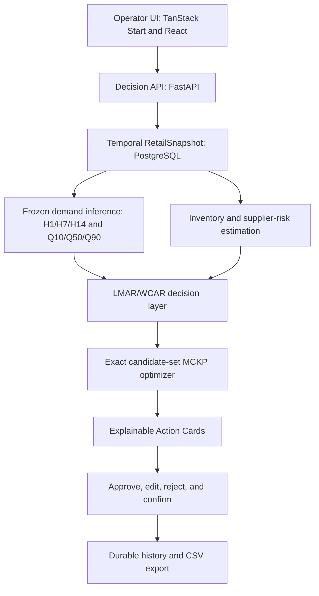

# RestockIQ

### Explainable, budget-aware retail restocking with human control

> RestockIQ turns uncertain demand, inventory position, supplier reliability, and a limited purchasing budget into an actionable restock plan.

RestockIQ is an end-to-end decision intelligence prototype for small-retail restocking. It does not stop at forecasting: it reconstructs demand censored by stockouts, produces cumulative demand quantiles, evaluates inventory and supplier risk, allocates one shared Rupiah budget, and lets an operator approve, edit, reject, and confirm every recommendation.

RestockIQ is **not** a POS, inventory CRUD system, autonomous purchasing agent, or generic analytics dashboard.

| Explore | Link |
|---|---|
| Live application | [https://119.28.104.198.nip.io](https://119.28.104.198.nip.io) |
| Forecast model and evaluation | [Hugging Face model repository](https://huggingface.co/zerosuum/restockiq-demand-v1) |
| Controlled-synthetic dataset | [Hugging Face dataset repository](https://huggingface.co/datasets/zerosuum/restockiq-synthetic-retail) |
| Immutable release identity | [GitHub Releases](https://github.com/Dzakiyaadila/triple-sigma/releases) after final HTTPS certification |

## The decision problem

A sales forecast alone does not tell a retailer what to purchase. The actual decision must account for:

- demand hidden by earlier stockouts;
- uncertainty across short and medium horizons;
- current stock and outstanding orders;
- supplier lead-time reliability;
- product economics and competing SKUs;
- one limited purchasing budget;
- operator judgment before a recommendation becomes final.

RestockIQ joins those constraints in one auditable workflow. The system recommends; the operator decides.

## Product journey

The public demo requires no account or external data:

1. Select **Demo Data**.
2. Choose a store, decision date, horizon, budget, and policy.
3. Generate a store-wide restock plan.
4. Inspect Action Cards, uncertainty, supplier context, and recommendation rationale.
5. Approve, edit, or reject individual recommendations.
6. Confirm the final decision.
7. Reopen the durable run history and export the plan as CSV.

The bundled demonstration scope contains **5 stores, 31 SKUs, and 28,210 daily retail observations**.

## What makes RestockIQ different

### Probabilistic demand inference

The frozen LightGBM artifact emits direct cumulative forecasts for `H1`, `H7`, and `H14`, each at `Q10`, `Q50`, and `Q90`. Production safeguards enforce temporal feature boundaries and repair quantile crossings before downstream planning.

### Stockout- and supplier-aware risk

Observed sales can understate demand when inventory reaches zero. RestockIQ reconstructs censored demand and combines effective inventory with supplier on-time probability and P90 lead time. The decision layer expresses the trade-off through lost-margin-at-risk (LMAR) and working-capital-at-risk (WCAR) estimates.

### Budget-constrained allocation

Each SKU contributes a generated set of quantity options. An exact sparse dynamic-programming solver selects one option per SKU under a shared Rupiah budget, forming a multiple-choice knapsack decision rather than an unconstrained ranking.

### Human-authoritative execution

Approve, edit, reject, and confirm mutations are server-authoritative. The interface changes state only after the backend accepts an action. Confirmed plans, recommendation decisions, metadata, history, and CSV export state are persisted in PostgreSQL.

## System architecture



Public traffic is terminated by Caddy and routed to the TanStack Start frontend and FastAPI backend. The backend uses PostgreSQL and a frozen, checksum-verified model bundle.

## Forecast evaluation

The released artifact was evaluated on a temporally held-out **June 2024 controlled-synthetic window**. Training data ends on **31 May 2024**. At every decision origin, prediction uses only information available through that origin; the latent-demand field `units_demanded_est` is joined only afterward as an evaluation label.

Q50 was compared with four causal observed-sales baselines: repeated seven-day seasonal demand, a 28-day moving average, span-28 EWMA, and Croston's method with `alpha = 0.1`.

| Horizon | Rows | Model MAE | Model RMSE | Model WMAPE | Strongest tested baseline | Baseline WMAPE | Relative result | Q10-Q90 coverage |
|---|---:|---:|---:|---:|---|---:|---:|---:|
| H1 | 4,495 | 2.384 | 3.590 | **31.33%** | Croston | 32.68% | **4.14% better** | 78.64% |
| H7 | 3,565 | 9.563 | 14.722 | 18.19% | MA-28 | **17.48%** | **4.10% worse** | 81.07% |
| H14 | 2,480 | 14.259 | 20.992 | **13.49%** | MA-28 | 14.42% | **6.46% better** | 83.15% |

Across **10,540 store-SKU-origin-horizon rows**, the model beats the strongest tested causal baseline at H1 and H14, while MA-28 remains stronger at H7. Quantile-crossing rows after production repair: **0**.

The mixed result is intentional evidence, not a hidden failure. It bounds the contribution accurately: RestockIQ demonstrates a complete, uncertainty-aware decision workflow; it does not claim universal forecasting superiority.

Full predictions, metrics, manifests, evaluator source, and checksums are published with the [model artifact](https://huggingface.co/zerosuum/restockiq-demand-v1/tree/main/evaluation).

## Model and data provenance

| Field | Frozen value |
|---|---|
| Model version | `restockiq-demand-v1-a067286b7c1e` |
| Training cutoff | `2024-05-31` |
| Training data hash | `a067286b7c1e966de43f3db9e1d24a7f8a440d236d94c24365c6d717ca44399c` |
| Forecast outputs | Direct cumulative H1/H7/H14 x Q10/Q50/Q90 |
| Production Oracle features | None |
| Evaluation scope | Controlled-synthetic June 2024 holdout |

Artifact integrity and the no-Oracle contract are checked during the backend build. The machine-readable claim boundary is frozen in [`docs/RC_POLICY_FREEZE.json`](docs/RC_POLICY_FREEZE.json) and verified against production code.

## Reproducibility and release identity

Model, evaluation, and dataset repositories contain SHA-256 manifests. Verify a downloaded bundle from its artifact directory with:

```bash
sha256sum -c SHA256SUMS
```

The README is part of the candidate commit, so it intentionally does not hard-code its own Git SHA. After the public HTTPS collector passes, an immutable Git tag and GitHub Release point to the exact deployed commit. Paper, video, and evidence manifests must cite that tag and commit without creating another documentation commit.

## Run locally

Requirements: Git, Docker Engine, and Docker Compose v2.

```bash
git clone https://github.com/Dzakiyaadila/triple-sigma.git
cd triple-sigma
cp .env.example .env
```

Set a non-default `POSTGRES_PASSWORD` in `.env`, then start the stack:

```bash
docker compose config --quiet
docker compose up --build -d
docker compose ps
python scripts/release_smoke.py
```

Open [http://localhost](http://localhost), or verify readiness directly:

```bash
curl -sS http://localhost/health/ready
```

For public HTTPS, configure `SITE_ADDRESS` and `ALLOWED_ORIGINS` for the public origin. See [GETTING_STARTED.md](GETTING_STARTED.md) and [`docs/RELEASE_RUNBOOK.md`](docs/RELEASE_RUNBOOK.md).

## Canonical validation

Backend:

```bash
cd backend
export DATABASE_URL="${RELEASE_TEST_DATABASE_URL:-sqlite+pysqlite:///:memory:}"
python -m pytest tests/ -q
python -m app.ml.verify_release_artifacts
python -m app.ml.verify_rc_contract
python -c "from app.main import app; print('FastAPI import OK')"
```

Frontend:

```bash
cd frontend
npm ci
npx tsc --noEmit
npm run lint
npm run build
npm run test:e2e:list
```

Release candidate:

```bash
python scripts/collect_release_evidence.py \
  --base-url https://your-public-host.example
```

The collector covers backend tests, artifact and policy verification, frontend gates, Compose state, release smoke, public HTTPS/TLS, and Chromium acceptance. A certifying pack must not use `--allow-http`, `--skip-docker`, or `--skip-browser`.

## Repository map

```text
triple-sigma/
|-- backend/                 # API, ML inference, risk, and optimizer
|-- frontend/                # Operator decision interface and E2E tests
|-- docs/                    # Claim freeze and release runbook
|-- scripts/                 # Smoke and evidence collection
|-- docker-compose.yml       # Local stack
|-- docker-compose.prod.yml  # Public deployment overrides
`-- GETTING_STARTED.md
```

## Scope and limitations

RestockIQ is a competition prototype, not a production-validated commercial inventory system.

- The quantitative evaluation uses a controlled-synthetic retail dataset.
- Forecast performance varies by horizon; H7 does not beat the strongest tested baseline.
- No realized stockout reduction, inventory-cost reduction, service-level uplift, savings, revenue uplift, ROI, or real-merchant impact is claimed.
- Uploaded CSVs remain outside the certified demo path; release evidence targets `demo-retail-v1`.
- A manual quantity edit recalculates quantity and cash but does not rerun the full LMAR/WCAR portfolio curve.
- A global minimum-fill-rate constraint is not implemented.
- Authentication, tenant isolation, production connectors, model monitoring/retraining, formal load testing, and high availability remain future work.

Future validation should prioritize longitudinal real-store data, common-budget sequential inventory simulation, production integrations, security, observability, and model-lifecycle controls.

## Team

Built by **Triple Sigma** as an end-to-end retail decision intelligence prototype.
